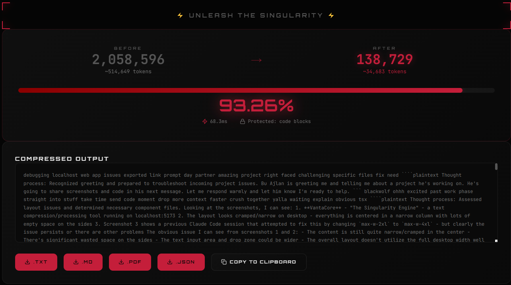

<div align="center">


# VantaCore

### The Singularity Engine

*"In the era of infinite context, noise is the enemy of reason."*

[](LICENSE)
[](https://vantacore.net)
[](https://github.com/DVRK-ORG/VantaCore)

**Compress massive AI chat sessions, logs, and knowledge bases into hyper-dense logic streams.**
**90-99% reduction. Zero data leaves your browser. Free forever.**

[🌐 Live App](https://vantacore.net) · [📋 Changelog](changelog.md) · [⭐ Star on GitHub](https://github.com/DVRK-ORG/VantaCore)

</div>

---

## 🔥 Real-World Results

> **500K+ token AI session → compressed in 68ms**

<div align="center">



</div>

| Metric | Value |
|--------|-------|
| **Before** | 2,058,596 chars (~514,649 tokens) |
| **After** | 138,729 chars (~34,683 tokens) |
| **Reduction** | **93.26%** |
| **Processing Time** | 68.3ms |
| **Code Blocks** | ✅ Protected |

---

## 🧬 What Is VantaCore?

VantaCore is a **client-side AI session compression engine** that strips every molecule of conversational waste from your AI chat logs, documentation, and knowledge bases — leaving only the raw DNA of the logic.

### The Problem
AI sessions accumulate massive amounts of noise:
- Model thinking blocks and system metadata
- Conversational filler ("Sure!", "Great question!", "Let me help you with that...")
- Repetitive explanations and emotional padding
- UI artifacts, UUIDs, URLs, timestamps

### The Solution
VantaCore's **Singularity Engine** runs 5 sequential operations that obliterate noise while protecting code blocks, technical identifiers, and actionable content:

1. **Universal Lowercase** — Normalizes text for consistent processing
2. **Nuclear Metadata Purge** — Eradicates UI elements, model blocks, UUIDs, URLs
3. **Punctuation Dissolving** — Strips formatting noise, preserves technical identifiers
4. **The Black Wolf Guillotine** — 400+ category lexicon eliminates conversational filler
5. **Absolute Global Shredder** — Sliding-window N-Gram deduplication

---

## ⚡ Key Features

- 🔒 **100% Client-Side** — Your data never leaves your browser. Zero servers. Zero tracking.
- 📁 **File Upload** — Drag & drop `.txt`, `.md`, `.json`, `.csv`, `.log` files
- 📋 **Paste & Compress** — Paste text directly into the editor
- 📊 **Real-Time Metrics** — Before/after comparison, token counts, processing time
- 💾 **Multi-Format Export** — Download as `.TXT`, `.MD`, `.PDF`, or `.JSON`
- 📑 **Copy to Clipboard** — One-click copy of compressed output
- 🛡️ **Code Block Protection** — Fenced code blocks survive compression intact
- 🎨 **Premium UI** — Vantablack dark theme with blood ruby accents

---

## 🚀 Quick Start

### Use Online
Visit **[vantacore.net](https://vantacore.net)** — no installation required.

### Run Locally

```bash
# Clone the repository
git clone https://github.com/DVRK-ORG/VantaCore.git
cd VantaCore/frontend

# Install dependencies
npm install

# Start development server
npm run dev
```

Open `http://localhost:5173` in your browser.

### Build for Production

```bash
npm run build
```

Output will be in the `dist/` directory, ready for static hosting.

---

## 🏗️ Tech Stack

| Layer | Technology |
|-------|-----------|
| **Framework** | React 19 + TypeScript 5 |
| **Build** | Vite 6 |
| **Styling** | Tailwind CSS + Custom CSS |
| **Animations** | Framer Motion |
| **State** | Zustand |
| **Engine** | Custom TypeScript (ported from Python) |
| **Hosting** | Cloudflare Pages |

---

## 🎯 Who Is It For?

| Audience | Use Case |
|----------|----------|
| 🤖 **AI Power Users** | Restart sessions with full context. 100K tokens → 2K tokens. |
| 💻 **Developers** | Compress debug sessions into dense reference docs. |
| 🔬 **Researchers** | Process massive research conversations into compact knowledge bases. |
| 🏢 **Enterprises** | Reduce AI API costs by 90-99% on batch pipelines. |
| 🌍 **Everyone** | If you've ever lost context because a session got too long — this is for you. |

---

## 📄 License

This project is licensed under the **MIT License** — see the [LICENSE](LICENSE) file for details.

---

<div align="center">

Built with 🖤 by **DARK**

**V4.0 — The Singularity Engine**

*We are the filter that leaves only the truth.*

</div>
