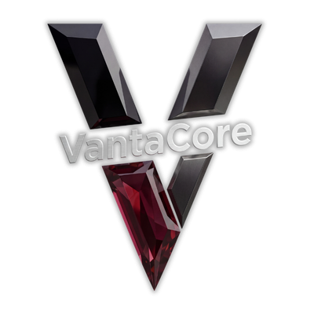
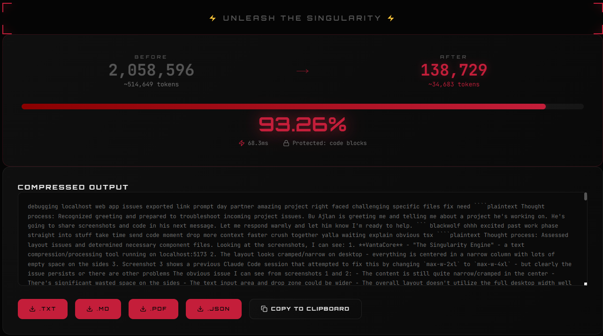

<div align="center">



# VantaCore

### Portable Memory Capsules for LLMs

**Compress massive AI sessions into portable memory capsules. 100% client-side.**

[](LICENSE)
[](https://vantacore.net)
[](https://github.com/DVRK-ORG/VantaCore)

VantaCore turns long chats, dev logs, research notes, and knowledge-base material into LLM-ready memory capsules that preserve final state, decisions, open loops, commands, artifacts, and do-not-repeat constraints.

[Live App](https://vantacore.net) - [Changelog](changelog.md) - [Upgrade Plan](VANTACORE_UPGRADE_PLAN_v1.md)

</div>

---

## Current Benchmark Proof

> Same merged multi-session AI export, now compressed into a structured Memory Capsule.

<div align="center">



</div>

| Metric | Before | After |
|--------|-------:|------:|
| **Characters** | 1,607,470 | 61,109 |
| **Estimated tokens** | ~401,868 | ~15,278 |
| **Reduction** | - | **96.20%** |
| **Protected code blocks** | - | 398 |
| **Topic clusters** | - | 6 |
| **Dictionary refs** | - | 17 |
| **Repeated blocks folded** | - | 114 |

---

## What VantaCore Is

VantaCore is a client-side compression and Memory Capsule engine for LLM continuity. It is built for:

- AI chat continuation
- RAG / Knowledge Base preparation
- Dev logs and coding-agent sessions
- Research notes
- API/token cost reduction
- MCP and agent workflows

It is not a generic summarizer or text shortener. The goal is continuity: help the next model know what happened, what was completed, what remains open, what decisions were made, and where to continue.

---

## Free Web Demo

- 100% client-side browser processing
- Paste text or upload `.txt`, `.md`, `.json`, `.csv`, `.log`
- Memory Capsule output with session map, final state, open loops, decision log, reference dictionary, and compressed detail stream
- Approximate token estimates
- Code block protection
- Clusters / refs / folds metrics
- 5 local compressions per day
- Last 20 local history entries stored only in browser storage
- Branded free exports for TXT/MD/JSON

VantaCore does not claim ownership of your input or output content. Free exports include VantaCore attribution as the generator of the memory-capsule format.

---

## Product Direction

Core principle:

> Free core. Paid power.

The free web demo stays useful, private, and client-side. Future Pro tracks are planned for power users and developers:

- CLI workflows
- MCP server tools
- batch/folder compression
- compression profiles
- advanced export formats
- project/workspace history
- no-branding exports
- API later, after CLI/MCP validation

No signup, backend, cloud sync, payment, or API is required for the current free demo.

---

## Run Locally

```bash
git clone https://github.com/DVRK-ORG/VantaCore.git
cd VantaCore/frontend
npm install
npm run dev
```

Open `http://localhost:5173`.

## Validate Compression

```powershell
cd C:\Users\DARK\Desktop\Projects\VantaCore\frontend
npm run validate:compression -- "C:\Users\DARK\Desktop\0Energy Check-in.md"
```

Expected current benchmark:

```text
input characters: 1,607,470
output characters: 61,109
input estimated tokens: 401,868
output estimated tokens: 15,278
reduction: 96.20%
repeated blocks folded: 114
dictionary references created: 17
clusters detected: 6
code blocks protected: yes (398 fenced; output balanced: yes)
```

## Build

```bash
npm run build
```

---

## Tech Stack

| Layer | Technology |
|-------|------------|
| Framework | React 19 + TypeScript 5 |
| Build | Vite |
| Styling | Tailwind CSS + custom CSS |
| Animations | Framer Motion |
| State | Zustand |
| Engine | Custom TypeScript Singularity engine |
| Hosting | Cloudflare Pages |

---

## License

MIT License.

Built by DARK.
